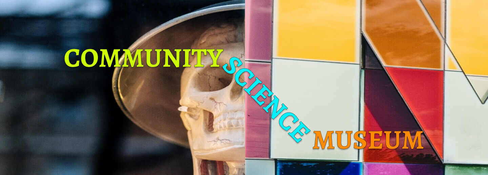

# Community Science Museum

2022-12-16_SP1_hans-marius-andreassen_fp

## Description

For this project we were tasked to design and develop a web page for the community science museum. Targeting ages 7-15 year olds. We were given text and images but colors, fonts and design was all up to us to create and design. I chose a color palette going for a dark theme but also with bright and vivid colors and for fonts I wanted to go a bit different so I paired Alegreya with Nunito with inspiration from the Figma community.

## Built with

- Figma
- HTML
- CSS

## Getting started

1. Clone the repo: `https://github.com/HMAsp/2022-12-16_semester_project1_HMAsp`

## Contributing

I would appreciate if you would open a pull request so the code can be reviewed if you want to play around with it.

## Contact

If you want to get in contact with me you can use either of the following:
* Email: mailspooky@yahoo.com
* [Twitter](https://twitter.com/HansMarAnd)
* [LinkedIn](https://www.linkedin.com/in/hma1982/)

Or visit my portfolio linked on my [Github profile page](https://github.com/HMAsp) and use the contact form!
